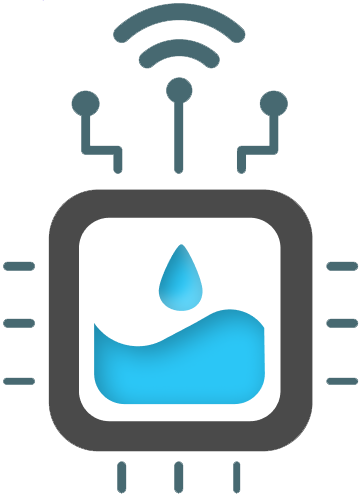

# Aguamenti-backend


<!-- PROJECT LOGO -->
<br />
<div align="center">
  <a href="https://github.com/anindyamitra15/Aguamenti-backend">
    
  </a>

<h3 align="center">Aguamenti Backend</h3>

  <p align="center">
    Backend framework to support the IoT implementation of an Automated Home Water Management System
    <br />
    <a href="https://docs.google.com/spreadsheets/d/1mV6BQ1xp7k6YXZtG5NI4eFCgBcqjfbj1YAz5qzBNO4M/edit?usp=sharing"><strong>Explore the docs »</strong></a>
    <br />
    <br />
    <a href="https://github.com/anindyamitra15/Aguamenti-backend">View Demo</a>
    ·
    <a href="https://github.com/anindyamitra15/Aguamenti-backend/issues">Report Bug</a>
    ·
    <a href="https://github.com/anindyamitra15/Aguamenti-backend/issues">Request Feature</a>
  </p>
</div>


<!-- TABLE OF CONTENTS -->
<details>
  <summary>Table of Contents</summary>
  <ol>
    <li>
      <a href="#about-the-project">About The Project</a>
      <ul>
        <li><a href="#built-with">Built With</a></li>
      </ul>
    </li>
    <li>
      <a href="#getting-started">Getting Started</a>
      <ul>
        <li><a href="#prerequisites">Prerequisites</a></li>
        <li><a href="#installation">Installation</a></li>
      </ul>
    </li>
    <li><a href="#roadmap">Roadmap</a></li>
    <li><a href="#contributing">Contributing</a></li>
    <li><a href="#license">License</a></li>
    <li><a href="#contact">Contact</a></li>
    <li><a href="#acknowledgments">Acknowledgments</a></li>
  </ol>
</details>


<!-- ABOUT THE PROJECT -->
## About The Project


To do
<!-- [![Product Name Screen Shot][product-screenshot]](https://example.com)

Here's a blank template to get started: To avoid retyping too much info. Do a search and replace with your text editor for the following: `github_username`, `repo_name`, `twitter_handle`, `linkedin_username`, `email`, `email_client`, `project_title`, `project_description` -->

<p align="right">(<a href="#top">back to top</a>)</p>


### Built With


* [JavaScript](https://www.javascript.com/)


<p align="right">(<a href="#top">back to top</a>)</p>


<!-- GETTING STARTED -->
## Getting Started

To do

### Prerequisites

This is an example of how to list things you need to use the software and how to install them.
* npm

  ```sh
  npm install npm@latest -g
  ```

### Installation

<!-- 1. Get a free API Key at [https://example.com](https://example.com)
2. Clone the repo

   ```sh
   git clone https://github.com/github_username/repo_name.git
   ```
3. Install NPM packages

   ```sh
   npm install
   ```
4. Enter your API in `config.js`

   ```js
   const API_KEY = 'ENTER YOUR API';
   ```
-->
<p align="right">(<a href="#top">back to top</a>)</p>


<!-- ROADMAP -->
## Roadmap

- [ ] Feature 1
- [ ] Feature 2
- [ ] Feature 3

See the [open issues](https://github.com/github_username/repo_name/issues) for a full list of proposed features (and known issues).

<p align="right">(<a href="#top">back to top</a>)</p>


<!-- CONTRIBUTING -->
## Contributing

Contributions are what make the open source community such an amazing place to learn, inspire, and create. Any contributions you make are **greatly appreciated**.

If you have a suggestion that would make this better, please fork the repo and create a pull request. You can also simply open an issue with the tag "enhancement".
Don't forget to give the project a star! Thanks again!

1. Fork the Project
2. Create your Feature Branch (`git checkout -b feature/AmazingFeature`)
3. Commit your Changes (`git commit -m 'Add some AmazingFeature'`)
4. Push to the Branch (`git push origin feature/AmazingFeature`)
5. Open a Pull Request

<p align="right">(<a href="#top">back to top</a>)</p>


<!-- LICENSE -->
## License

Distributed for fair usage under the MIT License. See `LICENSE.txt` for more information.

<p align="right">(<a href="#top">back to top</a>)</p>


<!-- CONTACT -->
## Contact

Repo Owner - [Anindya Mitra](https://github.com/anindyamitra15/)

Project Link: [https://github.com/anindyamitra15/Aguamenti-backend](https://github.com/anindyamitra15/Aguamenti-backend)

<p align="right">(<a href="#top">back to top</a>)</p>


<!-- ACKNOWLEDGMENTS -->
## Acknowledgments

to do


<p align="right">(<a href="#top">back to top</a>)</p>


<!-- MARKDOWN LINKS & IMAGES -->
<!-- https://www.markdownguide.org/basic-syntax/#reference-style-links -->
[contributors-shield]: https://img.shields.io/github/contributors/github_username/repo_name.svg?style=for-the-badge
[contributors-url]: https://github.com/github_username/repo_name/graphs/contributors
[forks-shield]: https://img.shields.io/github/forks/github_username/repo_name.svg?style=for-the-badge
[forks-url]: https://github.com/github_username/repo_name/network/members
[stars-shield]: https://img.shields.io/github/stars/github_username/repo_name.svg?style=for-the-badge
[stars-url]: https://github.com/github_username/repo_name/stargazers
[issues-shield]: https://img.shields.io/github/issues/github_username/repo_name.svg?style=for-the-badge
[issues-url]: https://github.com/github_username/repo_name/issues
[license-shield]: https://img.shields.io/github/license/github_username/repo_name.svg?style=for-the-badge
[license-url]: https://github.com/github_username/repo_name/blob/master/LICENSE.txt
[linkedin-shield]: https://img.shields.io/badge/-LinkedIn-black.svg?style=for-the-badge&logo=linkedin&colorB=555
[linkedin-url]: https://linkedin.com/in/linkedin_username
[product-screenshot]: images/screenshot.png
